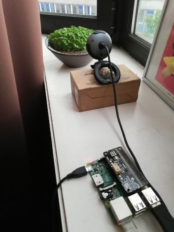

# PyLaspe - A simple Python tool based on OpenCV to generate time-lapses

## Pre-requisites

   - `python3`
   - `opencv`
   - `tqdm`

For long time-lapses, it may be useful to set it up on a Raspberry Pi

```sh
apt-get update
apt install python3-opencv
```

## Launch the picture-taking process

The following command

```sh
python3 -m pylaspe --itype=sec --dtype=day --night=10 --output=mylapse \
    --webcam=0 3 10
```

Will take pictures with webcam 0 for 3 days every 10 seconds
(every 100 seconds during the night) and store the pictures in folder `mylapse`

The time types (`--dtype`, `--itype`) can be:
  - `sec`
  - `min`
  - `hour`
  - `day`


## Make the movie

```sh
python3 -m pylaspe.make --fps=24 mylapse mylapse.mp4
```

Will make the video `mylapse.mp4` from folder `mylapse`.

It will automatically handle partially grey images (capture issues) and
remove black pictures. You may use the `--start` and `--end` options to make
a smaller clip.


## Example

Setup:



Result:
[](https://www.youtube.com/watch?v=UEL1ND1WBec )
